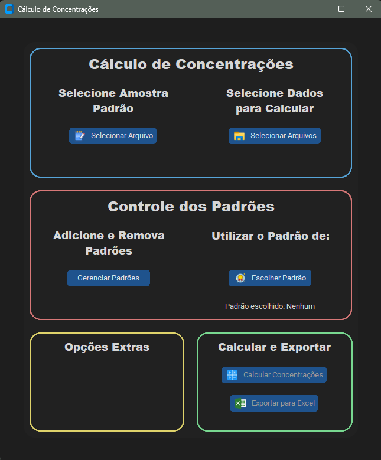

# **Aplicação para cálculo de concentrações em amostras**

Este projeto visa criar uma interface para inserção de dados coletados de amostras, analisadas por meio da técnica de Fluorescência de Raios - X (FRXDE). E, dessa forma, calcular suas respectivas concentrações.

### **Janela De Interação**

